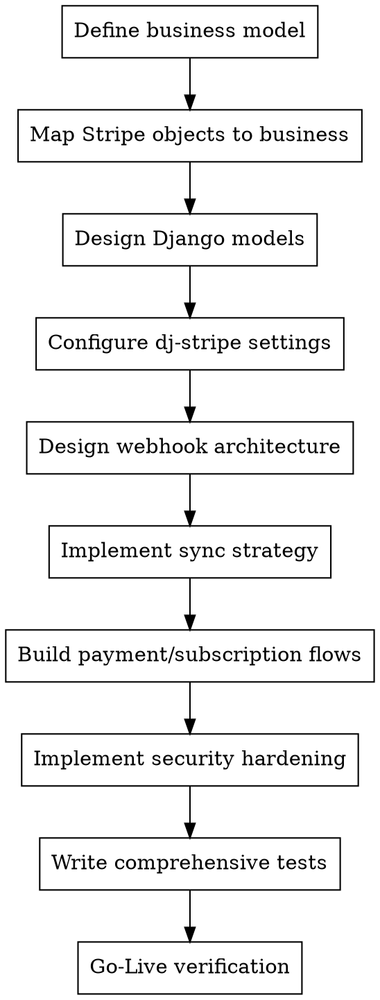

# Django Stripe — Payment Systems with dj-stripe

Comprehensive reference for building complete Stripe payment systems with Django
and dj-stripe. Covers everything from initial architecture to production Go-Live.

**Core principle:** Stripe is the source of truth. dj-stripe syncs Stripe data to
your local database. Your code reads from the DB and writes to the Stripe API.
Never modify synced records directly — always go through Stripe.


## Overview

dj-stripe syncs Stripe objects to your local Django database and dispatches webhook events via signal receivers. Stripe is the source of truth — your code writes to the Stripe API and reads from the synced local DB.

**Current versions:** dj-stripe 2.x (stripe-python >= 11.0), Django >= 5.1, Python >= 3.11, PostgreSQL >= 12

## Quick Navigation — Which File to Read

| Task | Start Here |
|---|---|
| Design the system from scratch | `references/architecture.md` |
| Install and configure dj-stripe | `references/installation.md` |
| Understand models and relationships | `references/models.md` |
| Handle webhooks reliably | `references/webhooks.md` |
| Manage subscriptions and billing | `references/subscriptions.md` |
| Process payments, Checkout, payment methods | `references/payments.md` |
| Sync data between Stripe and local DB | `references/sync-and-data.md` |
| Secure API keys, webhooks, PCI compliance | `references/security.md` |
| Write tests (unit, integration, webhook) | `references/testing.md` |
| Upgrade dj-stripe between major versions | `references/migrations.md` |
| Integrate with Stripe API (versioning, patterns) | `references/stripe-api.md` |

---

## Critical Rules

### Rule 1: Stripe is the source of truth

The local database is a sync/cache copy. Write to the Stripe API, read from the local DB. **Never** modify synced dj-stripe model instances directly. **Never** create dj-stripe records outside of the sync/webhook path.

### Rule 2: Webhooks drive all state changes

Don't poll Stripe API for updates. All state synchronization comes through webhooks. Every handler must be idempotent — Stripe redelivers events and all handlers run in a single database transaction.

```python
from djstripe.event_handlers import djstripe_receiver

@djstripe_receiver("checkout.session.completed")
def handle_checkout_completed(sender, event, **kwargs):
    session_data = event.data["object"]
    customer = Customer.objects.get(id=session_data["customer"])
    # Fulfill order — MUST be idempotent
```

### Rule 3: Register handlers in AppConfig.ready()

```python
class MyAppConfig(AppConfig):
    def ready(self):
        import myapp.webhooks  # imports trigger @djstripe_receiver registration
```

### Rule 4: PostgreSQL for production

JSONField operations (`stripe_data` queries) require PostgreSQL. SQLite is acceptable for development only.

### Rule 5: Never set STRIPE_API_VERSION

dj-stripe pins this internally to its tested version (`2020-08-27`). Changing it breaks sync logic and model compatibility.

### Rule 6: Stripe IDs as primary keys

Always configure `DJSTRIPE_FOREIGN_KEY_TO_FIELD = "id"` in settings. This uses Stripe IDs (e.g., `cus_xxx`) as FK targets instead of internal auto-increment IDs.

---

## Quick Reference

### Settings Configuration

```python
STRIPE_LIVE_SECRET_KEY = os.environ.get("STRIPE_LIVE_SECRET_KEY")
STRIPE_TEST_SECRET_KEY = os.environ.get("STRIPE_TEST_SECRET_KEY")
STRIPE_LIVE_MODE = False  # True in production
DJSTRIPE_FOREIGN_KEY_TO_FIELD = "id"
```
```python
INSTALLED_APPS = [
    "djstripe",
]
urlpatterns = [
    path("stripe/", include("djstripe.urls", namespace="djstripe")),
]
```

### Customer & Checkout

```python
from djstripe.models import Customer
import stripe

customer, created = Customer.get_or_create(subscriber=user)

checkout_session = stripe.checkout.Session.create(
    mode="payment",  # payment | subscription | setup
    line_items=[{"price": price_id, "quantity": 1}],
    metadata={"djstripe_subscriber": user.id},
    success_url=request.build_absolute_uri("/success/"),
    cancel_url=request.build_absolute_uri("/cancel/"),
)
```

### Subscription Management

```python
customer.subscribe(items=[{"price": price}], trial_period_days=30)
customer.subscription.update(proration_behavior="none")
customer.subscription.cancel(at_period_end=True)
```

---

## Design and Development Flow

This flow works for greenfield projects AND refactoring existing Stripe integrations.



### Phase 1: Business Model Definition

1. **Define what you sell:** one-time products, recurring subscriptions, usage-based,
   multi-tier, marketplace fees
2. **Define customer model:** free users, paid users, organizations with multiple seats
3. **Define pricing:** fixed prices, metered usage, per-seat, tiered, graduated
4. **Define billing cycles:** monthly, annual, custom intervals
5. **Map taxes:** which jurisdictions, tax codes, tax IDs to collect

**Output:** A document mapping your business objects to Stripe concepts.
See `stripe-api.md` for Stripe product/price modeling patterns.

### Phase 2: Object Mapping

| Business concept     | Stripe object      | dj-stripe model     | Notes                     |
| -------------------- | ------------------ | ------------------- | ------------------------- |
| Customer             | Customer           | `Customer`          | Linked to User via FK     |
| Product              | Product            | `Product`           | What you sell             |
| Price                | Price              | `Price`             | How much + currency       |
| Subscription         | Subscription       | `Subscription`      | Recurring billing         |
| One-time payment     | PaymentIntent      | `PaymentIntent`     | SCA-compliant             |
| Invoice              | Invoice            | `Invoice`           | Auto-generated by Stripe  |
| Payment method       | PaymentMethod      | `PaymentMethod`     | Card, bank, etc.          |
| Refund               | Refund             | `Refund`            | Full or partial           |

See `models.md` for complete model catalog with all fields and relationships.

### Phase 3: Django Model Design

1. **AUTH_USER_MODEL linkage:** Link `Customer` to your user model via `subscriber` FK
   ```python
   customer, created = Customer.get_or_create(subscriber=user)
   ```
2. **Extend with your models:** Create models that reference dj-stripe models via FK.
   Never subclass dj-stripe models.
3. **Metadata strategy:** Use `metadata` on Stripe objects to link back to your app:
   ```python
   stripe.checkout.Session.create(
       metadata={"djstripe_subscriber": user.id, "order_id": order.id},
   )
   ```

See `architecture.md` for complete project structure and design patterns.

### Phase 4: Configuration

1. **Required settings:**
   ```python
    STRIPE_LIVE_SECRET_KEY = os.environ.get("STRIPE_LIVE_SECRET_KEY", "{your secret key}")
    STRIPE_TEST_SECRET_KEY = os.environ.get("STRIPE_TEST_SECRET_KEY", "{your secret key}")
   STRIPE_LIVE_MODE = False  # True in production
   DJSTRIPE_FOREIGN_KEY_TO_FIELD = "id"
   ```
2. **DO NOT set `STRIPE_API_VERSION`** — dj-stripe pins it to its tested version (`2020-08-27` internally)
3. **Database:** PostgreSQL >= 12 recommended. SQLite for dev only.
4. **API key storage:** Add secret keys via Django admin (dj-stripe stores them in the database). Environment variables above remain usable as a fallback.

See `installation.md` for complete setup instructions.

### Phase 5: Webhook Architecture

1. **Register webhook endpoint in Stripe Dashboard** using your deployed webhook URL (e.g. `https://example.com/stripe/webhook`)
2. **Enable signature verification** — per-endpoint tolerance
3. **Write idempotent handlers:**
   ```python
   from djstripe.event_handlers import djstripe_receiver

   @djstripe_receiver("checkout.session.completed")
   def handle_checkout_completed(sender, event, **kwargs):
       session_data = event.data["object"]
       customer = Customer.objects.get(id=session_data["customer"])
       # Fulfill the order — must be idempotent
   ```
4. **Register handlers in `AppConfig.ready()`:**
   ```python
   class MyAppConfig(AppConfig):
       def ready(self):
           import myapp.webhooks
   ```
5. **Test locally:** `stripe listen --forward-to localhost:8000/stripe/webhook/`

See `webhooks.md` for complete webhook architecture, error handling, and testing.

### Phase 6: Sync Strategy

**Initial sync:** `python manage.py djstripe_sync_models`

**Ongoing:** Webhooks keep data in sync automatically. Manual sync for:
- New models added: `python manage.py djstripe_sync_models Price`
- Backfill historical data: `Customer.sync_from_stripe_data(stripe_data)`
- Reprocess failed events: `python manage.py djstripe_process_events --failed`

See `sync-and-data.md` for complete sync patterns and `stripe_data` JSONField usage.

### Phase 7: Payment and Subscription Flows

1. **Checkout Sessions** (hosted page, easiest): Create session → redirect → handle webhook
2. **Payment Intents** (custom UI + Payment Element): More control, more code
3. **Subscriptions:** `customer.subscribe(items=[{"price": price}], trial_period_days=30)`
4. **Charges:** `customer.charge(amount=Decimal("10.00"), currency="usd")`

See `payments.md` and `subscriptions.md` for complete workflows.

### Phase 8: Security Hardening

1. **Restricted API keys** (`rk_`) for dj-stripe — limits Stripe-side permissions
2. **Webhook signature verification** — prevents forged events
3. **PCI compliance:** card data never touches your server (Stripe.js/Elements handle it)
4. **Environment variables** for secret keys — never commit to source control
5. **Encrypt billing database** — contains customer billing data and API keys

See `security.md` for complete security architecture.

### Phase 9: Testing

1. **Unit tests:** Test webhook handlers, model methods, sync logic
2. **Integration tests:** Test full flows with Stripe test mode
3. **Webhook tests:** `stripe trigger` CLI, fixture-based testing
4. **Key fixtures:** `tests/fixtures/` with mapped IDs

See `testing.md` for test strategies, fixture management, and CI setup.

### Phase 10: Go-Live Verification

```markdown
- [ ] Stripe API keys in environment variables (not code)
- [ ] STRIPE_LIVE_MODE = True in production
- [ ] Webhook endpoints registered in Stripe Dashboard
- [ ] Webhook signature verification enabled (tolerance > 0)
- [ ] All webhook handlers are idempotent
- [ ] PCI compliance: no raw card data touches server
- [ ] Database backups configured (PostgreSQL)
- [ ] Monitoring/alerting on webhook failures
- [ ] dj-stripe version pinned in requirements
- [ ] All tests pass against latest fixtures
- [ ] Stripe account in live mode with valid business info
```


---

## Common Mistakes (From Baseline Testing)

- **Modifying synced records** → data lost on next webhook sync. Always go through Stripe API.
- **Non-idempotent handlers** → duplicate fulfillment on retry. Use `event.idempotency_key` or deduplication checks.
- **Installing jsonfield/jsonfield2 alongside dj-stripe >= 2.10** → `ImportError`. dj-stripe uses Django's native JSONField.
- **Setting STRIPE_API_VERSION** → breaks sync. dj-stripe pins this internally.
- **Using SQLite in production** → JSONField queries fail or behave differently.
- **Hardcoding API keys in settings.py** → committed to git. Use environment variables.
- **Forgetting AppConfig.ready() import** → handlers silently never register.
- **Skipping versions when upgrading** → migrations depend on sequential path.
- **Polling Stripe API for state** → race conditions. Use webhooks exclusively.
- **Using internal PKs instead of Stripe IDs** → must set `DJSTRIPE_FOREIGN_KEY_TO_FIELD = "id"`.

---

## Architecture Principles

1. **Stripe is always source of truth.** Local DB is a cache/sync copy.
2. **Write to Stripe API, read from local DB.** Use synced models for queries.
3. **Webhooks drive state changes.** Don't poll Stripe API for updates.
4. **All handlers must be idempotent.** Stripe redelivers events.
5. **PostgreSQL for production.** JSONField operations require it.
6. **Restricted keys for dj-stripe.** Principle of least privilege.
7. **Never skip dj-stripe versions when upgrading.** Sequential migration path required.
8. **Stripe IDs as primary keys.** Use `DJSTRIPE_FOREIGN_KEY_TO_FIELD = "id"`.


---

## Red Flags — STOP and Read the Reference

| "I'll just update the Charge model directly" | No. Stripe is source of truth → `references/architecture.md` |
| "SQLite is fine for production" | No. JSONField requires PostgreSQL → `references/installation.md` |
| "I'll set STRIPE_API_VERSION to the latest" | No. dj-stripe pins this → `references/stripe-api.md` |
| "The handler doesn't need to be idempotent" | It does → `references/webhooks.md` |
| "I'll skip this version upgrade" | No. Every version required → `references/migrations.md` |
| "I'll poll the API for subscription changes" | No. Use webhooks → `references/webhooks.md` |
| "I'll hardcode the test secret key" | No. Use env vars → `references/security.md` |
| "jsonfield package is fine alongside dj-stripe" | No. Causes ImportError → `references/installation.md` |

## Key Versions

| Component    | Current version         |
| ------------ | ----------------------- |
| Stripe API   | 2026-04-22.dahlia       |
| Stripe API (dj-stripe pinned) | 2020-08-27    |
| dj-stripe    | 2.x (verify latest at pypi.org/project/dj-stripe/) |
| Django       | >= 5.1                  |
| Python       | >= 3.11                 |
| PostgreSQL   | >= 12                   |
